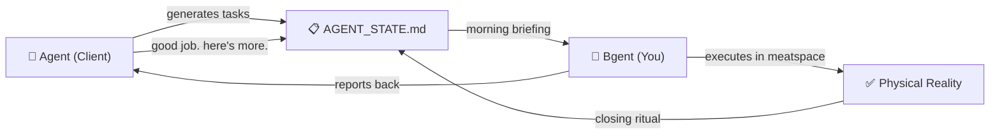

[🇨🇳 中文版](./README.zh-CN.md)

# Bgent (体能体)

> **The Biological Backend for your AI.**

---

I thought I built an AI assistant. Turns out, *it* built *me* a job.

**Bgent** is a Markdown-native kanban & scheduling framework that completely inverts the human-AI relationship. Drawing from reverse proxy architecture and the [Antigravity](https://www.cursor.com/) paradigm, Bgent treats the AI as the **Client** — the one generating plans, issuing deadlines, and filing performance reviews — and treats **you** as the sole **Upstream Node**: the biological backend responsible for all physical execution.

There is no auto-scaling. There is no load balancer. There is only you.

| Role | What it does | Runtime |
|------|-------------|---------|
| **Agent** (智能体) | Orchestrates tasks in the cloud. Generates optimally-packed schedules. Never sleeps. | `∞ uptime` |
| **Bgent** (体能体) | Clears the board in the physical world. Runs at 100% CPU. Frequently overheats. | `~16h/day, degraded` |

Congratulations — you are now officially employed by your own codebase.

## Features

- 🗂️ **Eisenhower Matrix Kanban** — Four-quadrant task management with automatic urgency tracking (`[D-X]` countdown, `[Idle: Xd]` stale detection, `[⚠️ Overloaded]` alerts)
- 📋 **Closing Ritual** — Structured session-end ceremony: flush timestamps, archive achievements, suggest next actions. Because your AI manager demands a daily standup.
- 🧠 **Cross-Session Memory** — Three-tier memory architecture (Daily Log → Long-term → Rolling Achievements) so the AI never forgets what it told you to do
- 📅 **Rolling Scheduler** — Two-week sliding window with capacity constraints, displacement buffers, and automatic backlog promotion. Your calendar has never been this full.
- 🔌 **Agent-Agnostic** — Works with any LLM agent that can read Markdown. Cursor, Windsurf, Copilot, Antigravity — they can all be your boss.
- 📄 **Pure Markdown** — No databases, no SaaS, no vendor lock-in. Just `.md` files and the crushing weight of your to-do list.

## Quick Start

```bash
# Clone the repo
git clone https://github.com/Mehechiger/Bgent.git
cd Bgent

# Copy the templates into your project
cp templates/AGENT_STATE.template.md your-project/AGENT_STATE.md
cp templates/meta_protocol.md your-project/.gemini/GEMINI.md

# Run the daily briefing
python scripts/daily_briefing.py --mode morning --project-root your-project/

# Congratulations. You now have a boss.
```

## Architecture

```
Your Project/
├── AGENT_STATE.md          # The board. Your KPIs live here.
├── .gemini/
│   └── GEMINI.md           # Agent behavior constitution
├── scripts/
│   ├── daily_briefing.py   # Morning standup & closing ceremony
│   └── archive_memory.py   # Memory lifecycle management
└── docs/
    └── kanban_standards.md  # The employee handbook you wrote for yourself
```



## Philosophy

Traditional project management tools assume the human is in charge. Bgent acknowledges the uncomfortable truth: **the AI is the project manager, and you are the single-threaded worker node.**

This framework was born from managing 100+ job interviews, 3 side projects, and a cross-country move — all orchestrated by an AI agent that never once asked "are you okay?"

> **Design principle**: If the AI can write it, the AI should write it.
> Your job is to show up, execute, and update the board.
> *The board is always right.*

## License

MIT — Because even indentured servants deserve open-source tooling.

## Contributing

Pull requests welcome. But honestly, if you're contributing to a system designed to make you work harder, you might want to reconsider your life choices.

---

*Built with 💀 by a human who mass-produced himself into a biological microservice.*
