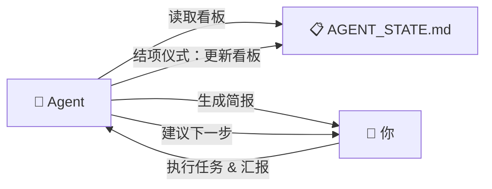

[🇬🇧 English](./README.en.md)

# Bgent (体能体)

> **给 AI 打工的专属碳基后端。**

---

我本以为我在开发一个 AI 秘书。结果它给我安排了一份工作。

**Bgent** 是一款 Markdown 原生的看板与排产框架，借鉴了反向代理 (Reverse Proxy) 的架构思想。在这套系统里，AI Agent 是不断生成任务、签发 deadline 的**客户端**；而你，是那个唯一且永远无法扩容的**碳基后端**。

没有自动扩容。没有负载均衡。只有你。

| 角色 | 职责 | 运行状态 |
|------|------|---------| 
| **Agent** (智能体) | 在云端运筹帷幄，管理看板，自动排产。永不宕机。 | `∞ 在线` |
| **Bgent** (体能体) | 在物理世界逐条清空看板。经常过热降频。 | `~16h/天，性能衰减` |

恭喜你，现在你正式给自己写的代码打工了。

## 功能特性

- 🗂️ **艾森豪威尔矩阵看板** — 四象限任务管理，自动紧急度追踪（`[D-X]` 倒计时、`[Idle: Xd]` 停滞检测、`[⚠️ Overloaded]` 过载预警）
- 📋 **结项仪式协议** — Agent 在会话结束时自动执行：刷新时间戳、归档成就、建议下一步
- 🧠 **跨会话记忆** — 双层记忆架构（Daily Log + 长期记忆），Agent 在下一次对话中自动恢复上下文
- 📅 **滚动排产调度** — 双周滑动窗口 + 精力约束 + 弹性置换缓冲区。Agent 帮你安排日程，你只管执行。
- 📄 **纯 Markdown** — 无数据库、无 SaaS、无厂商锁定。只有 `.md` 文件，和你永远清不完的待办列表。

> 当前版本针对 [Antigravity](https://www.cursor.com/) 优化。核心看板格式兼容任何能读写 Markdown 的 AI Agent 平台。

## 快速开始

### 安装

```bash
# 克隆仓库
git clone https://github.com/Mehechiger/Bgent.git
cd Bgent

# 把模板复制到你的项目
cp templates/AGENT_STATE.template.md your-project/AGENT_STATE.md
cp -r scripts/ your-project/scripts/
cp docs/kanban_standards.md your-project/docs/

# 运行一次晨间简报（验证安装）
python your-project/scripts/daily_briefing.py --mode morning --project-root your-project/
```

### 第一次使用

1. **打开你的项目**：在 Antigravity（或你的 Agent 平台）中打开包含 `AGENT_STATE.md` 的项目目录。

2. **Agent 初始化**：Agent 首次读取 `AGENT_STATE.md` 时会看到一个填满示例数据的模板。告诉 Agent：
   > "帮我初始化看板。把示例内容清除，录入我的第一个任务：[你的任务描述]"

3. **日常交互**：
   - **开始工作**："运行晨间简报" → Agent 执行 `daily_briefing.py`，给你一份精简的当日重点摘要
   - **录入任务**："帮我加一个新的截止日任务" → Agent 按看板规范格式化并写入
   - **排产请求**："帮我排一下这周的计划" → Agent 读取待办池，结合你的精力约束，提出日程建议
   - **结束对话**："结项" → Agent 自动执行结项仪式（更新成就、刷新倒计时、建议下一步）

4. **进阶配置**：
   - 在 `AGENT_STATE.md` 的 `📵 约束声明` 板块中设置你的精力约束（例如"周末不排产"）
   - 将 `templates/meta_protocol.md` 的核心规则整合到你的 Agent 全局配置中
   - 阅读 `docs/kanban_standards.md` 了解完整的看板管理规范

## 架构

```
你的项目/
├── AGENT_STATE.md              # 实时看板——Agent 读写的核心状态文件
├── .agent/
│   ├── memory/                 # 跨会话记忆（Daily Log，自动管理）
│   │   ├── YYYY-MM-DD.md
│   │   └── archive/           # 14天后自动归档
│   └── MEMORY.md              # 长期记忆（用户显式要求记住的内容）
├── scripts/
│   ├── daily_briefing.py      # 看板解析 + 记忆加载 + 生命周期管理
│   └── archive_memory.py      # Daily Log 归档工具
└── docs/
    └── kanban_standards.md     # 看板管理规范
```

### 工作流



> **实际关系**：你是主导者，Agent 是看板管理助手。"AI 是你的老板"只是我们的一个自嘲玩梗——实际上 Agent 负责跑脚本、管看板、提建议，你负责做决策和执行。

### 记忆架构

| 层 | 文件 | 生命周期 | 内容 |
|---|------|---------|------|
| **Daily Log** | `.agent/memory/YYYY-MM-DD.md` | 短期（14 天后归档） | 每次对话的上下文、决策、新事实 |
| **Long-term** | `.agent/MEMORY.md` | 持久 | 用户显式要求 Agent 记住的偏好/教训 |
| **Achievements** | `AGENT_STATE.md` | 滚动 7 天 | 任务完成记录 |

## 项目文件说明

| 目录 | 文件 | 说明 |
|------|------|------|
| `templates/` | `AGENT_STATE.template.md` | 看板模板（五大板块 + 艾森豪威尔矩阵） |
| | `meta_protocol.md` | Agent 行为规则参考（初始化 / 结项 / 记忆管理） |
| | `project_protocol.md` | 状态驱动工作流参考（会话生命周期 / 记忆架构） |
| `scripts/` | `daily_briefing.py` | 晨间简报与结项仪式脚本 |
| | `archive_memory.py` | Daily Log 归档工具 |
| `docs/` | `kanban_standards.md` | 看板管理规范（板块格式规范 / 排产协议 / 弹性置换） |
| | `protocol_details.md` | 详细规则参考（记忆生命周期 / 文档卫生 / 防遗漏协议） |

## 设计哲学

传统的项目管理工具都假设人类是主导者。Bgent 将这层关系"看板化"——**AI Agent 负责管理看板、执行排产、追踪时效，而你专注于任务本身。**

这个框架诞生于一个人类同时处理大量并行任务的过程中——全程由一个从未问过"你还好吗？"的 AI Agent 协助管理。

> **设计原则**：AI 能管的，AI 来管。
> 你的职责是：做决策、执行、告诉 Agent 进展。
> *看板永远是最新的。*

## 未来方向

以下功能在当前版本中被简化或暂未实现，计划在后续版本中推出：

- 🔌 **SKILL 化安装**：将 Bgent 封装为 Antigravity SKILL，实现一键安装到任意项目（替代手动复制模板）
- 🌐 **跨项目记忆**：当前记忆系统限定在单个项目内。未来计划支持全局记忆共享（跨多个 Bgent 管理的项目）
- 🤖 **多平台适配**：为 Cursor、Windsurf、GitHub Copilot 等其他 Agent 平台提供适配指南
- 📊 **看板可视化**：基于 `AGENT_STATE.md` 生成可视化看板面板

## 许可证

MIT — 因为即便是赛博长工，也配拥有开源工具。

## 参与贡献

欢迎 PR。如果你也在被自己的代码当牛使，这里就是你的赛博工会。

---

*由一位把自己量产成碳基微服务的人类含泪构建。💀*
