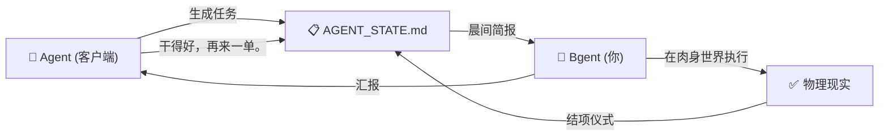

[🇬🇧 English](./README.md)

# Bgent (体能体)

> **给 AI 打工的专属碳基后端。**

---

我本以为我在开发一个 AI 秘书。结果它给我安排了一份工作。

**Bgent** 是一款彻底反转了人机主客关系的 Markdown 原生看板与排产框架。它致敬了反向代理 (Reverse Proxy) 和 [Antigravity](https://www.cursor.com/) 架构的核心思想——在这个系统里，AI 是那个不断发出排产请求、签发 deadline、撰写绩效报告的**客户端**；而你，被封装成了系统里唯一且永远无法扩容的**上游节点：碳基后端**。

没有自动扩容。没有负载均衡。只有你。

| 角色 | 职责 | 运行状态 |
|------|------|---------|
| **Agent** (智能体) | 在云端运筹帷幄，生成排满每一秒的最优日程。永不宕机。 | `∞ 在线` |
| **Bgent** (体能体) | 在物理世界耗尽全部算力，疯狂清空看板。经常过热降频。 | `~16h/天，性能衰减` |

恭喜你，现在你正式给自己写的代码打工了。

## 功能特性

- 🗂️ **艾森豪威尔矩阵看板** — 四象限任务管理，自动紧急度追踪（`[D-X]` 倒计时、`[Idle: Xd]` 停滞检测、`[⚠️ Overloaded]` 过载预警）
- 📋 **结项仪式协议** — 结构化的会话收尾流程：刷新时间戳、归档成就、建议下一步。因为你的 AI 领导要求你每天做日报。
- 🧠 **跨会话记忆** — 三层记忆架构（Daily Log → 长期记忆 → 滚动成就），确保 AI 永远不会忘记它给你布置过什么任务
- 📅 **滚动排产调度** — 双周滑动窗口 + 精力约束 + 弹性置换缓冲区 + Backlog 自动提升。你的日程从未如此充实。
- 🔌 **Agent 无关** — 适配任何能读 Markdown 的大模型 Agent。Cursor、Windsurf、Copilot、Antigravity——它们都可以成为你的领导。
- 📄 **纯 Markdown** — 无数据库、无 SaaS、无厂商锁定。只有 `.md` 文件，和你永远清不完的待办列表。

## 快速开始

```bash
# 克隆仓库
git clone https://github.com/Mehechiger/Bgent.git
cd Bgent

# 把模板复制到你的项目
cp templates/AGENT_STATE.template.md your-project/AGENT_STATE.md
cp templates/meta_protocol.md your-project/.gemini/GEMINI.md

# 运行晨间简报
python scripts/daily_briefing.py --mode morning --project-root your-project/

# 恭喜。你现在有领导了。
```

## 架构

```
你的项目/
├── AGENT_STATE.md          # 看板。你的 KPI 在这里。
├── .gemini/
│   └── GEMINI.md           # Agent 行为宪法
├── scripts/
│   ├── daily_briefing.py   # 晨间简报与结项仪式
│   └── archive_memory.py   # 记忆生命周期管理
└── docs/
    └── kanban_standards.md  # 你亲手写给自己的员工手册
```



## 设计哲学

传统的项目管理工具都假设人类是主导者。Bgent 直面了一个令人不安的事实：**AI 才是项目经理，而你只是一个单线程的执行节点。**

这个框架诞生于管理 100+ 场面试、3 个副业项目和一次跨城搬家的过程中——全程由一个从未问过"你还好吗？"的 AI Agent 指挥编排。

> **设计原则**：AI 能写的，AI 来写。
> 你的职责是：到场、执行、更新看板。
> *看板永远是对的。*

## 许可证

MIT — 因为即便是赛博长工，也配拥有开源工具。

## 参与贡献

欢迎 PR。但说真的，如果你正在给一个让你更加内卷的系统做贡献，也许你该重新审视一下自己的人生选择。

---

*由一位把自己量产成碳基微服务的人类含泪构建。💀*
