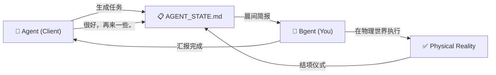
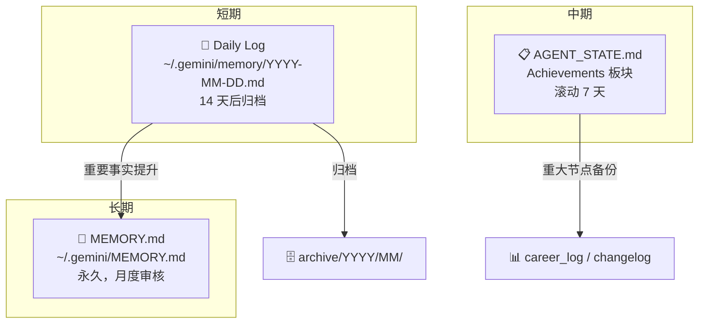

# Architecture — Bgent 框架架构

## 核心隐喻：反向代理

传统项目管理假设人类是控制者。Bgent 反转这个关系：

```
传统模式:  Human → [管理] → AI (工具)
Bgent:     AI (Client) → [调度] → Human (Upstream Node)
```

借鉴反向代理 (Reverse Proxy) 架构：

| 概念 | 反向代理 | Bgent |
|------|---------|-------|
| **Client** | 外部请求方 | 🤖 AI Agent |
| **Proxy** | Nginx / HAProxy | 📋 AGENT_STATE.md |
| **Upstream** | 后端服务器 | 🧑 你（物理执行者） |
| **Health Check** | 定期 Ping | daily_briefing.py |
| **Load Balancer** | 分发流量 | Eisenhower Matrix |

## 数据流



## 文件架构

```
Your Project/
├── AGENT_STATE.md              # 实时看板 — Agent 读写的核心状态文件
├── .gemini/
│   └── GEMINI.md               # Agent 行为宪法 (来自 templates/meta_protocol.md)
├── scripts/
│   ├── daily_briefing.py       # 看板解析 + 记忆加载 + 生命周期管理
│   └── archive_memory.py       # Daily Log 归档工具
├── docs/
│   └── kanban_standards.md     # 看板管理规范
└── README.md                   # 项目说明 + 状态驱动工作流定义
```

## 三层记忆架构



## Agent 无关性

Bgent 对 Agent 平台零依赖。任何能读写 Markdown 的 LLM Agent 都可以做你的"老板"：

| 平台 | 配置文件路径 | 说明 |
|------|------------|------|
| Cursor | `.cursor/rules` | 将 meta_protocol.md 内容放入 |
| Windsurf | `.windsurfrules` | 同上 |
| GitHub Copilot | `.github/copilot-instructions.md` | 同上 |
| Antigravity | `.gemini/GEMINI.md` | 原生支持 |

关键在于：Agent 能在会话启动时读取 `AGENT_STATE.md`，并在任务完成后更新它。
